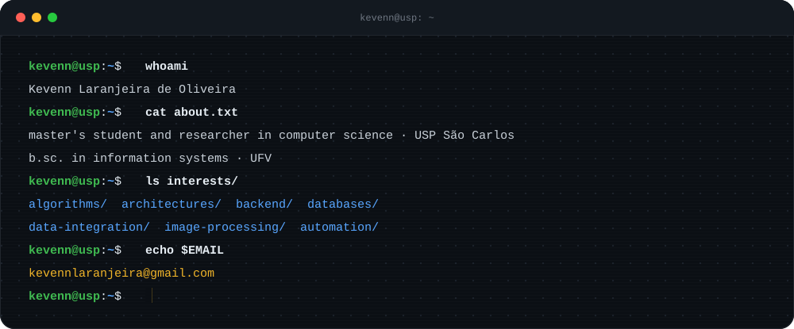
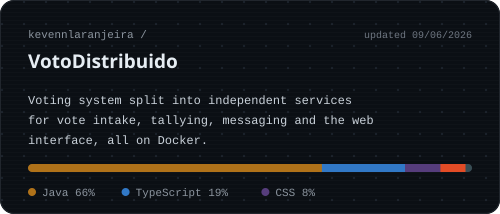
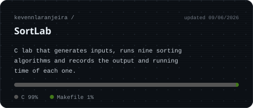
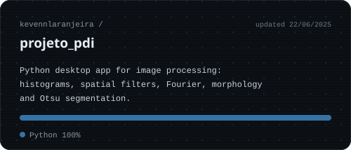

  

<!-- PROFILE:BADGES:START -->

<!-- PROFILE:BADGES:END -->

## About me

I'm a master's student in Computer Science and a researcher at USP, in São Carlos, Brazil. Before that I got my bachelor's degree in Information Systems at the Federal University of Viçosa (UFV).

I learn best by building. I take the theory, turn it into code, measure the result and keep adjusting until the solution is clear to whoever comes next. The public repositories here include a voting system in Java and TypeScript running on Docker, a C lab for sorting algorithms and a Python app for image processing.

## Tech stack

## Featured projects

<!-- PROFILE:PROJECTS:START -->

<!-- PROFILE:PROJECTS:END -->

## Repository languages

<!-- PROFILE:LANG_STATS:START -->

  

<!-- PROFILE:LANG_STATS:END -->

## Tic-tac-toe

You play X against the bot. Click an empty cell and GitHub opens a pre-filled issue, then just submit it. In less than a minute the bot answers and the board below changes. The game is shared, so whoever comes next picks up where you left off. The bot slips up now and then, so you can beat it.

<!-- PROFILE:GAME:START -->

<code>Game #1 · your turn, you play X</code>

<table>
  <tr><td></td><td></td><td></td></tr>
  <tr><td></td><td></td><td></td></tr>
  <tr><td></td><td></td><td></td></tr>
</table>

Scoreboard: visitors <b>0</b> · bot <b>0</b> · draws <b>0</b>

Nobody is on the leaderboard yet.

<!-- PROFILE:GAME:END -->

## Contributions

  <picture>
    <source media="(prefers-color-scheme: dark)" srcset="https://raw.githubusercontent.com/kevennlaranjeira/kevennlaranjeira/output/github-snake-dark.svg" />
    <source media="(prefers-color-scheme: light)" srcset="https://raw.githubusercontent.com/kevennlaranjeira/kevennlaranjeira/output/github-snake.svg" />
    
  </picture>

## Contact

