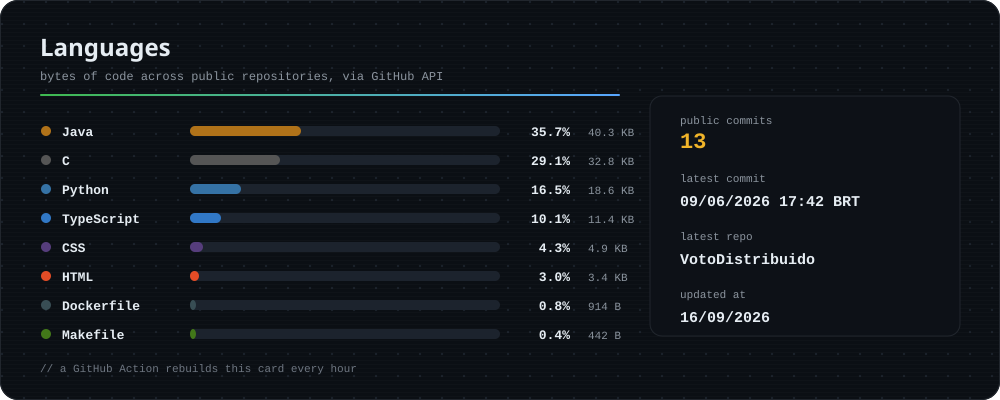

  <strong>Trocar idioma</strong> <em>Change language</em> 
  

<!-- PROFILE:BADGES:START -->

<!-- PROFILE:BADGES:END -->

## About me

Hi! I am **Kevenn Laranjeira de Oliveira**, bachelor in **Information Systems from the Federal University of Viçosa (UFV)** and currently a master's student in **Computer Science at PPG-CCMC, University of São Paulo (USP)**, developing scientific research focused on **Data Science**.

I am interested in building software on a solid computing foundation, combining algorithms, systems, databases, data processing, and useful interfaces. Through my public projects, I explore **Java/TypeScript** applications, **C/C++**, **SQL/PostgreSQL**, **Dart**, and **Python** experiments for digital image and data processing.

## Areas that appear in my projects

- **Web systems and applications:** application structure with Java, TypeScript, HTML, CSS, and Docker.
- **Databases and backend:** modeling, queries, and persistence with SQL and PostgreSQL.
- **Algorithms and performance:** implementation and analysis in C/C++, with Makefile and experimental organization.
- **Processing and Data Science:** Python experiments for data and image manipulation, analysis, and interpretation.
- **Computer Science research:** academic training oriented toward scientific investigation, technical reading, and reproducible solutions.

## Technologies

## Repository languages

<!-- PROFILE:LANG_STATS:START -->

  

<!-- PROFILE:LANG_STATS:END -->

## Featured projects

<!-- PROFILE:PROJECTS:START -->

<!-- PROFILE:PROJECTS:END -->

## Activity

## In short

I like learning by building: turning theory into code, measuring results, improving the solution, and leaving projects clearer for whoever comes next. Right now, my path brings together **academic training**, **software development**, and **Computer Science research**.

