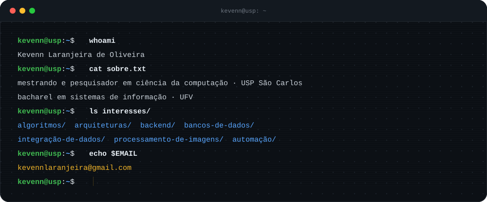
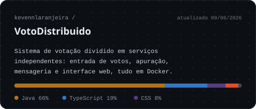
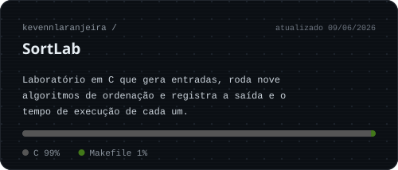
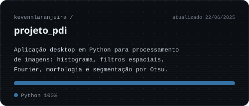
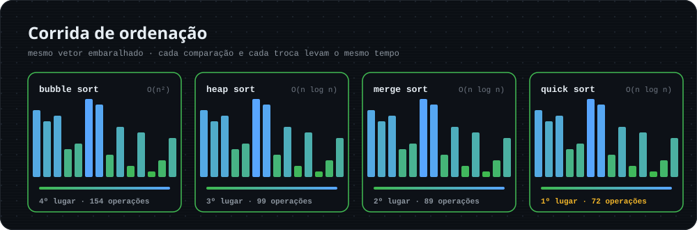
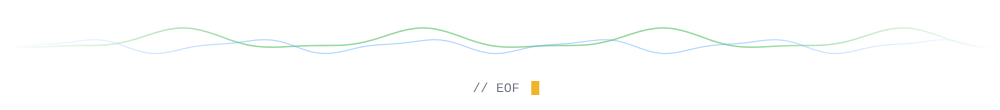

  

<!-- PROFILE:BADGES:START -->

<!-- PROFILE:BADGES:END -->

## Sobre mim

Sou mestrando em Ciência da Computação e pesquisador na USP, em São Carlos. Antes disso me formei em Sistemas de Informação na Universidade Federal de Viçosa (UFV).

Aprendo melhor construindo. Pego a teoria, transformo em código, meço o resultado e vou ajustando até a solução ficar clara para quem vier depois. Nos repositórios abertos aqui tem um sistema de votação em Java e TypeScript rodando em Docker, um laboratório de algoritmos de ordenação em C e uma aplicação de processamento de imagens em Python.

## Tecnologias

## Projetos em destaque

<!-- PROFILE:PROJECTS:START -->

<!-- PROFILE:PROJECTS:END -->

## Linguagens nos repositórios

<!-- PROFILE:LANG_STATS:START -->

  

<!-- PROFILE:LANG_STATS:END -->

## Corrida de ordenação

Quatro algoritmos do meu [SortLab](https://github.com/kevennlaranjeira/SortLab) ordenando o mesmo vetor embaralhado. Na animação, cada comparação e cada troca levam o mesmo tempo, então a diferença entre O(n²) e O(n log n) aparece a olho nu.

## Contribuições

  <picture>
    <source media="(prefers-color-scheme: dark)" srcset="https://raw.githubusercontent.com/kevennlaranjeira/kevennlaranjeira/output/github-snake-dark.svg" />
    <source media="(prefers-color-scheme: light)" srcset="https://raw.githubusercontent.com/kevennlaranjeira/kevennlaranjeira/output/github-snake.svg" />
    
  </picture>

## Contato

