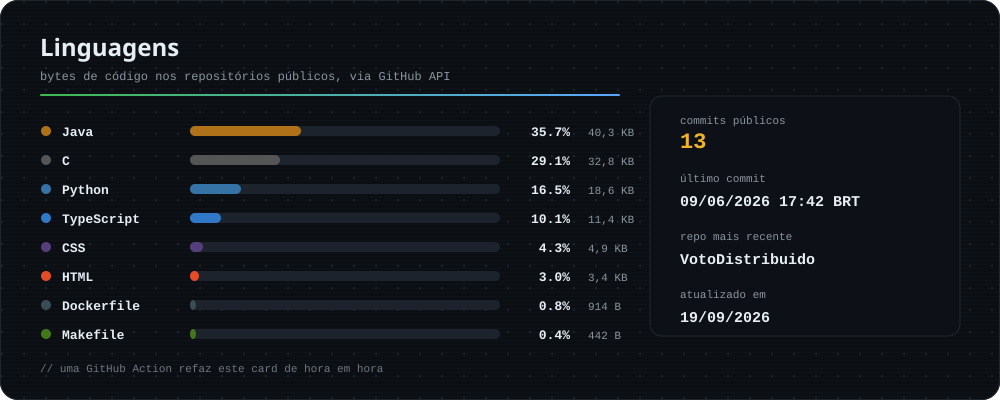

  <strong>Trocar idioma</strong> <em>Switch language</em> 
  

<!-- PROFILE:BADGES:START -->

<!-- PROFILE:BADGES:END -->

## Sobre mim

Olá! Eu sou **Kevenn Laranjeira de Oliveira**, bacharel em **Sistemas de Informação pela Universidade Federal de Viçosa (UFV)** e atualmente mestrando em **Ciência da Computação no PPG-CCMC pela Universidade de São Paulo (USP)**, desenvolvendo minha pesquisa na área científica com foco em **Ciência de Dados**.

Tenho interesse em construir software com base sólida em computação, combinando fundamentos de algoritmos, sistemas, bancos de dados, processamento de dados e interfaces úteis. Pelos meus projetos públicos, venho explorando desde aplicações em **Java/TypeScript** até estudos em **C/C++**, **SQL/PostgreSQL**, **Dart** e experimentos em **Python** voltados a processamento digital de imagens e dados.

## Áreas que aparecem nos meus projetos

- **Sistemas e aplicações web:** estruturação de aplicações com Java, TypeScript, HTML, CSS e Docker.
- **Bancos de dados e backend:** modelagem, consultas e persistência com SQL e PostgreSQL.
- **Algoritmos e desempenho:** implementação e análise em C/C++, com Makefile e foco em organização experimental.
- **Processamento e Ciência de Dados:** experimentos em Python para manipulação, análise e interpretação de dados e imagens.
- **Pesquisa em computação:** formação acadêmica orientada a investigação científica, leitura técnica e construção de soluções reproduzíveis.

## Tecnologias

## Linguagens nos repositórios

<!-- PROFILE:LANG_STATS:START -->

  

<!-- PROFILE:LANG_STATS:END -->

## Projetos em destaque

<!-- PROFILE:PROJECTS:START -->

<!-- PROFILE:PROJECTS:END -->

## Atividade

## Em resumo

Gosto de aprender construindo: transformar teoria em código, medir resultados, melhorar a solução e deixar o projeto mais claro para quem vier depois. No momento, minha trajetória junta **formação acadêmica**, **desenvolvimento de software** e **pesquisa em Ciência da Computação**.

